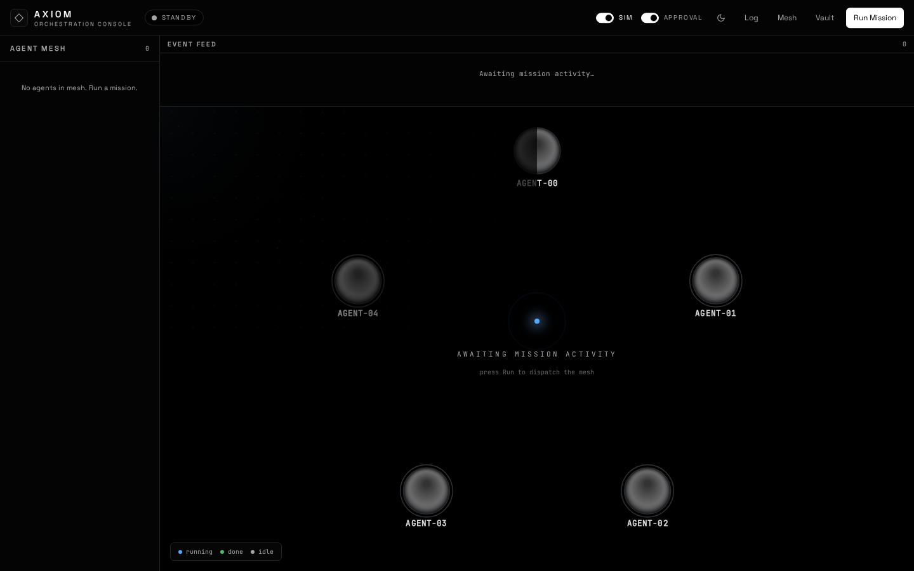
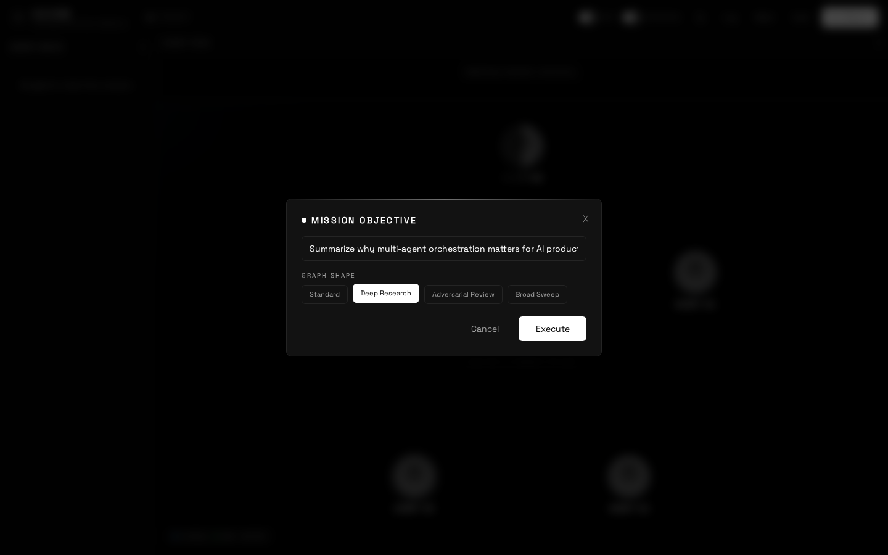
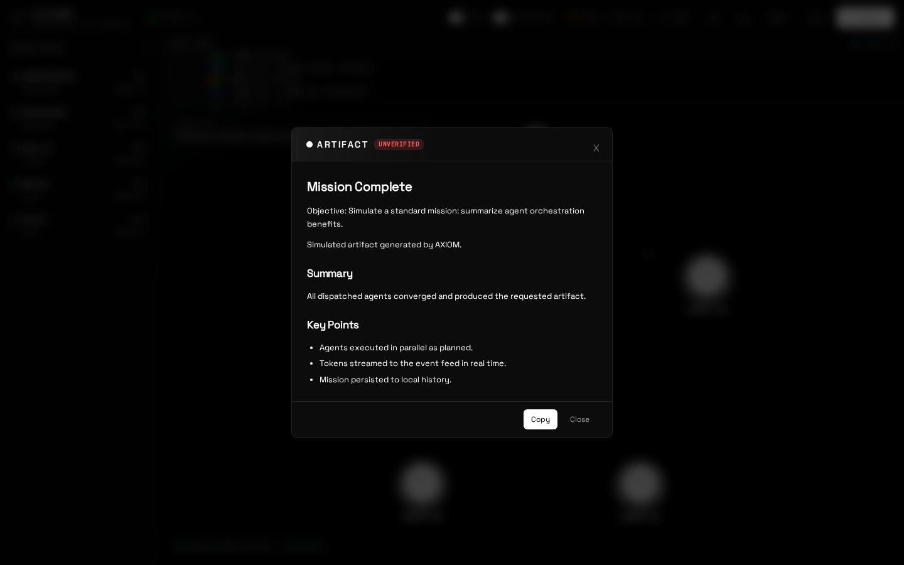
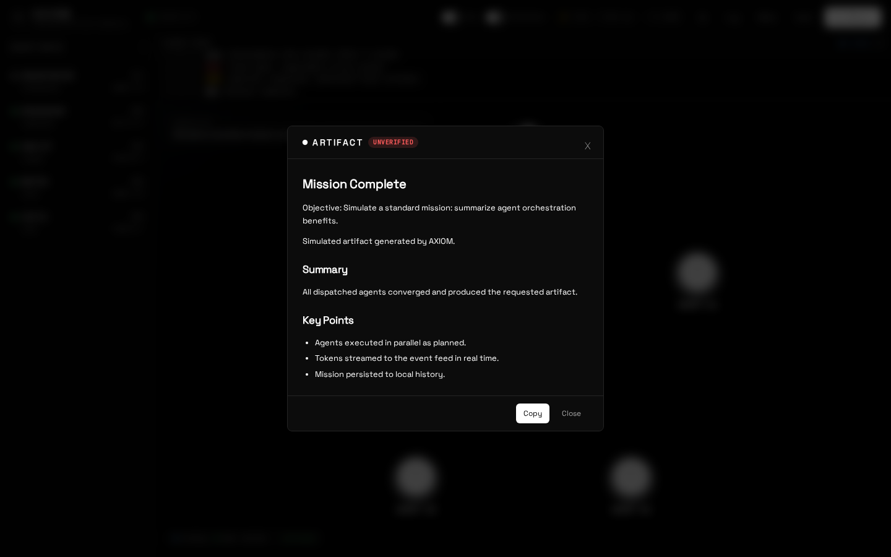
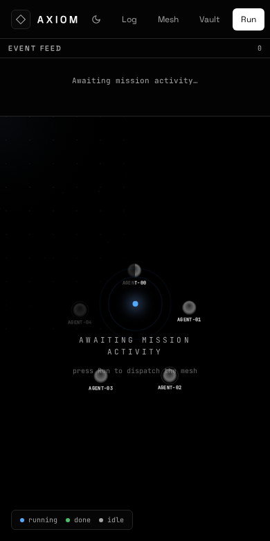
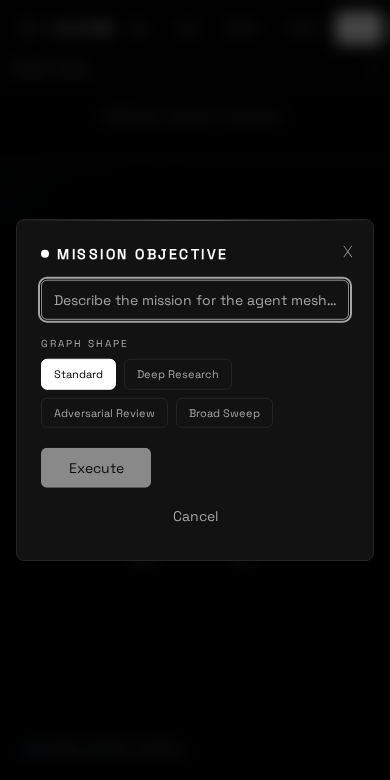
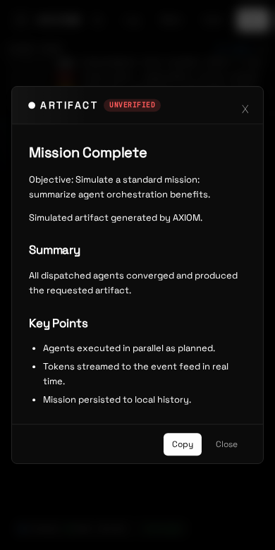
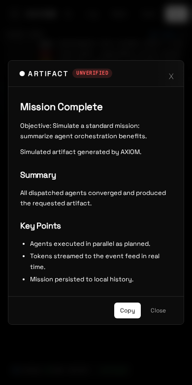

# AXIOM · Agentic Orchestration Console

AXIOM is a monochrome, browser-native orchestration console that turns an OpenRouter API key into a live agent mesh. The user enters a mission objective, an LLM orchestrator plans and dispatches tasks to specialized agents in parallel, and the whole execution is visualized in real time on a Canvas 2D scene with streaming tokens, event feed, and a markdown artifact modal.

## Phase 2 Addendum

- Anti-Bias Gate: Fresh Context critic + Jury Mode with majority vote
- Isolated draft-shard artifacts + deterministic merge node
- Amdahl telemetry + HUD chip
- Graph Shapes: Standard, Deep Research, Adversarial Review, Broad Sweep
- Expanded tests/docs + Playwright per-shape e2e

## Phase 4 — Free-model support, QA & mobile polish

- **OpenRouter `:free` tier works end-to-end.** Default agents now target verified free models
  (`google/gemma-4-26b-a4b-it:free`, `z-ai/glm-5.2:free`, `nvidia/nemotron-3-super-120b-a12b:free`,
  `poolside/laguna-xs-2.1:free`). No key charges in SIM or real mode.
- **BYOK key actually reaches the engine.** The provider was previously built once from a non-existent
  `VITE_` env value (always empty → 401). It now lazily reads the key you connect with (Vault →
  `localStorage`/`sessionStorage`/Stronghold) and is injected into the Web Worker (workers have no
  `localStorage`) via `setRuntimeKey`/`ensureProviderFor`.
- **Failure-signal hardening** (false-green audit):
  - Critic `fallbackModel` is free (`poolside/laguna-xs-2.1:free`) — a paid fallback would silently
    charge the user on model outage. Regression-guarded by a test.
  - `budgetAvailable` no longer swallows a 401 as "ok": an invalid key surfaces a clear
    `BUDGET ▸ API key rejected by OpenRouter (401)` fault before the mission starts.
  - Empty/unknown model responses fail fast (`unavailable`) instead of looping as `transient`.
- **Mobile layout fixed.** The header overflowed ~67px on ≤390px viewports, clipping the primary
  "Run Mission" CTA. The logo subtext now hides below `sm`, clusters shrink (`min-w-0`), and the CTA
  collapses to "Run" on mobile — fully reachable, no horizontal scroll at 390×780.
- **Regression suite added.** `tests/policies.test.ts` (free-tier fallback + error classification) and
  `tests/vault_budget.test.ts` (invalid-key / exhausted / unreachable budget signals). Live e2e
  (`e2e/live_free.spec.ts`) runs a real mission against OpenRouter free models in a browser.

## Project demo

AXIOM running in a real browser (Chromium) against OpenRouter free models — idle mesh, mission
dispatch, live agent activity, and the delivered artifact.

### Desktop

| Boot / idle mesh | Objective + graph-shape selector | Mission running | Delivered artifact |
| --- | --- | --- | --- |
|  |  |  |  |

### Mobile (390×780)

| Idle mesh | Objective dialog | Mission running | Artifact |
| --- | --- | --- | --- |
|  |  |  |  |

> Screenshots captured with `e2e/shots.spec.ts` (`pnpm run test:e2e --e2e/shots.spec.ts` after
> `pnpm run dev`). If a free-model run is rate-limited, re-run — the engine retries transients.

## Stack

- Vite + React 19 + TypeScript 7 (strict)
- Tailwind v4 via `@tailwindcss/vite`
- State: Zustand, TanStack Query
- LLM: OpenRouter via Vercel AI SDK + `@openrouter/ai-sdk-provider`
- Animation: `motion/react`, GSAP
- Persistence: Dexie (IndexedDB)
- Markdown: react-markdown, remark-gfm, shiki
- Fonts: self-hosted via `@fontsource/space-grotesk`, `@fontsource/jetbrains-mono`
- Testing: Vitest, Playwright
- Desktop: Tauri 2 + `tauri-plugin-stronghold`

## Quick start

```bash
pnpm install
pnpm run dev
pnpm run build
pnpm run lint
pnpm test
pnpm run test:e2e
```

If `pnpm` is unavailable or broken in your shell, use the Corepack fallback:

```bash
corepack enable
npx pnpm@latest install
npx pnpm@latest run dev
```

## Environment

- `VITE_API_BASE` — optional OpenRouter base URL. Defaults to `https://openrouter.ai/api/v1`.
- `VITE_SEARCH_ENDPOINT` — optional Wikipedia-compatible search endpoint for `web_search`.
- All network calls go to OpenRouter directly from the browser. For production, route through your own proxy and set `VITE_API_BASE` to that proxy origin.

### Proxy mode

Deploy `proxy/worker.ts` to Cloudflare Workers:

```bash
cd proxy
npx wrangler deploy
```

Then set `VITE_API_BASE` to the worker origin. The proxy handles CORS, rate limiting, and unbuffered SSE streaming.

## BYOK / Security

- The user supplies their own OpenRouter key via the Vault dialog.
- Keys are stored in `localStorage` by default, or `sessionStorage` when “Session only” is checked.
- In Tauri desktop builds, keys are stored via `tauri-plugin-stronghold` instead of web storage.
- Keys are masked in the UI as `••••+last4` and are never logged or sent anywhere except the `Authorization` header.
- AXIOM never persists mission artifacts with secrets; artifacts contain only model output.

## Graph model

AXIOM now treats missions as a production graph with typed primitives:

- **NODE**: an agent with a role, model, system prompt, declared `outputSchema`, `failure` state, and per-role `policy` (retries, fallback model, on-fail behavior). Default schemas enforce structured JSON for researcher, analyst, writer, and critic.
- **EDGE**: a routed dispatch from orchestrator to worker. Edges carry artifact references (`artifactId`, `summary`) in planning context, never full transcripts.
- **STATE**: durable mission state stored via Dexie `checkpoints` after every step and gate/policy event. Enables resume after reload or interruption.
- **ROUTER**: deterministic orchestrator loop. Tracks route decisions, artifact refs, convergence, and step budgets. History contains references + summaries only.
- **GATE**: `final-gate` runs every time `final` is emitted. Deterministic checks validate content, schema, and citations. An independent critique pass follows. FAIL routes back for repair up to 2 rounds; exhausted failures deliver with `verified:false`.

### Events

New additive bus events:

- `artifact-stored` — emitted when an artifact is persisted.
- `gate-start` / `gate-pass` / `gate-fail` — final-gate lifecycle.
- `policy-applied` — per-node failure policy decision.
- `convergence` — emitted when research hits dry rounds or budget cap.
- `approval-requested` — emitted when delivery requires human approval.
- `checkpoint-updated` — emitted after every durable state write.
- `resume-available` — emitted on app load when interrupted missions can be resumed.

### Settings

- **Require approval before delivery** — persisted toggle. Default ON for real missions, OFF in SIM mode. When enabled, gate PASS puts the mission into `awaiting-approval`; the ApprovalDialog lets users Approve, Reject with feedback, or Abort.

### Resume semantics

- On app load, AXIOM scans checkpoints with status `running|paused|awaiting-approval|interrupted` and surfaces a **RESUME MISSION** button in Header.
- Resume restores history from artifact references + decisions, continues from `currentStep`, and logs `SYS ▸ resumed from step N`.
- RESET and completion clear/archive checkpoints. Abort marks `interrupted`.

## Architecture

### Engine (`src/engine/`)
Pure TypeScript, zero React/DOM. Owns:
- `types.ts` — `BusEvent`, `AgentDef`, `Plan`, `MissionRecord`, `ArtifactRecord`, `CheckpointRecord`
- `bus.ts` — typed event bus used as the only cross-layer seam
- `vault.ts` — key storage, masking, localStorage/sessionStorage/Stronghold helpers, budget guard
- `openrouter.ts` — `API_BASE`, auth header factory, `/key` and `/models` fetch helpers
- `protocol.ts` — Zod schema for orchestrator JSON + repair-and-retry parser
- `agents.ts` — `AGENT_DEFS` registry, model overrides, dynamic spawn, output schemas, policies
- `artifacts.ts` — artifact schema, structured summary extraction, repair parser, artifact-stored event helper
- `gates.ts` — `final-gate` deterministic checks, critique, repair rounds, verdict emission
- `policies.ts` — per-role failure policy resolution and `policy-applied` bus emission
- `checkpoints.ts` — durable mission checkpoint store with localStorage + memory fallback
- `storage.ts` — Dexie-backed `ArtifactStore` and `CheckpointStore`
- `orchestrator.ts` — plan loop, parallel dispatch, artifact persistence, gate integration, convergence, budgets
- `simulator.ts` — offline SIM mode exercising artifact store, gate, policy, convergence, checkpoints
- `graph.ts` — node/edge data model + physics step
- `tools.ts` — `web_search` and `code_exec` tool registry with Zod schemas

### Render (`src/render/`)
Canvas 2D scene, zero React imports, owns its `requestAnimationFrame` loop:
- `scene.ts` — DPR handling, grid/dust/vignette, camera transforms
- `nodes.ts` — node birth, halo, selection brackets, radar sweep, done glyph
- `edges.ts` — draw-in edges, message particles with trails, delivery flash
- `input.ts` — drag node, pan, zoom-to-cursor, click-select

### UI (`src/ui/`)
React 19 components. Never call APIs directly; consume stores + bus:
- `App.tsx` — layout shell, overlay mounts, motion wrappers
- `components/BootOverlay.tsx` — GSAP boot timeline
- `components/Header.tsx` — brand, status, metrics, controls, resume button
- `components/Roster.tsx` — agent list / mobile Sheet
- `components/Feed.tsx` — throttled event stream with gate/policy/convergence lines
- `components/Stage.tsx` — canvas host, rAF loop, bus bindings
- `components/DetailCard.tsx` — selected node inspector + model picker + tool list + contract section
- `components/ArtifactModal.tsx` — react-markdown + COPY + verification badge
- `components/HistoryDrawer.tsx` — Dexie mission log
- `components/ObjectivePrompt.tsx` — mission input dialog
- `components/GraphDrawer.tsx` — inspectable routing decisions drawer
- `components/ApprovalDialog.tsx` — human approval / escalation dialog
- `hooks/` — useBus, useKeyInfo, useModels

### Stores (`src/stores/` and `src/ui/stores/`)
Zustand stores:
- `mission.ts` — status, objective, step/total, fault, current artifact id, verified flag
- `mesh.ts` — roster mirror, agent states, model overrides, tool list
- `vault.ts` — connected, masked key, balance, async connect/disconnect
- `feed.ts` — 90-entry log with ~80ms throttled flush, gate/policy/convergence entries
- `settings.ts` — speed 1|2|4, reduced motion
- `ui/stores/bus.ts` — UI overlay state + bus→Zustand bridge

## Tool-calling

AXIOM agents can use built-in tools during streaming:

- `web_search` — searches Wikipedia REST API for top 5 page results. Attached to RESEARCHER by default. Overridable via `VITE_SEARCH_ENDPOINT`.
- `code_exec` — executes JavaScript in a sandboxed context with 2s timeout. Attached to ANALYST by default. Output is marked `untrusted`.

Tools emit `tool-call` and `tool-result` bus events, which appear in the Feed and ping the node canvas.

## Cost observability

- `src/engine/cost.ts` caches model pricing and records per-call token usage.
- Mission-level and per-node cost is emitted via `cost-updated`.
- UI surfaces cost in `Header.tsx` (`$` chip) and `GraphDrawer.tsx` (sorted monochrome bars).

## Context management

- `src/engine/context.ts` builds the orchestrator context under `CONTEXT_BUDGET`.
- Always includes system prompt, objective, graph shape, available agents, and last 3 steps.
- Older steps are compacted into a one-line-per-step digest; full artifacts are only loaded on explicit full-read paths.

## Worker architecture

- `src/engine/worker.ts` hosts heavy engine work off the UI thread.
- `src/engine/client.ts` exposes `runMission`, `abortMission`, `ingestFile`, `searchKnowledge`, and `destroy`.
- If `Worker` is unavailable, it falls back to in-thread execution behind the same API.

## Local RAG

- `src/engine/rag.ts` provides chunking, embedding, cosine search, and ingest/search bus events.
- `knowledge_search` tool is attached to RESEARCHER and uses local embeddings only.
- Dexie `chunks` table persists ingested text + embeddings; SIM mode can use pre-baked vectors.
- `src/ui/components/FileDropZone.tsx` provides drag/drop + browse ingestion UI.

## Persistence

- Dexie `missions` table: `id`, `objective`, `endedAt`, `steps`, `tokens`, `artifact`
- Dexie `artifacts` table: `id`, `missionId`, `nodeId`, `kind`, `summary`, `content`, `createdAt`
- Dexie `checkpoints` table: `missionId`, `status`, `currentStep`, `completedNodes`, `decisions`, `artifactIds`, `budgets`, `updatedAt`
- Dexie `chunks` table: `id`, `missionScope`, `sourceFile`, `text`, `embedding`, `createdAt`
- Browser: localStorage/sessionStorage for keys, model overrides, speed, session-only flag, checkpoints
- Desktop: `tauri-plugin-stronghold` for secure key storage

## Keyboard & A11y

- Space: run/pause
- Esc: close overlays
- Focus rings, `aria-live` status, real buttons
- Canvas: `role="img"` with descriptive `aria-label`

## Desktop packaging (Tauri 2)

Verified build on Linux (Fedora 42, x86_64). The native bundle compiles and produces `.deb` and `.rpm`.

Prerequisites:
- Rust toolchain (`rustup`, `cargo`)
- Linux system libraries (Tauri 2 webview + tray + stronghold):
  ```bash
  sudo dnf install -y webkit2gtk4.1-devel libsoup3-devel gtk3-devel \
    libappindicator-gtk3-devel librsvg2-devel openssl-devel patchelf
  # for AppImage output only (optional):
  sudo dnf install -y squashfs-tools
  ```
- A Tauri icon set in `src-tauri/icons/` (generate from any 1024×1024 PNG with `pnpm tauri icon <png>`).

Install Rust if missing:
```bash
curl --proto '=https' --tlsv1.2 -sSf https://sh.rustup.rs | sh
```

Build & release:
```bash
pnpm install
pnpm run tauri:dev      # dev with hot reload (frontend on :1420)
pnpm run tauri:build    # produces platform bundles in src-tauri/target/release/bundle
bash scripts/tauri-release.sh 2.1.0   # build + copy to release/ + create GitHub release
```

Notes / fixes applied this release:
- `tauri.conf.json`: removed the invalid Tauri-1 `platforms` key (platforms are inferred from target).
- `pnpm-workspace.yaml`: requires a valid `packages` field or `pnpm run build` fails in workspace mode.
- `src-tauri/build.rs` + `Cargo.toml build = "build.rs"` are required so `tauri-build` runs codegen
  (`generate_context!` and capability validation).
- `tauri-plugin-stronghold` resolved to 2.3.1, whose API changed: there is no `init()` — the plugin is
  registered via `tauri_plugin_stronghold::Builder::with_argon2(&salt_path).build()` in `main.rs`.
- Capability `default.json` references only `core:default` + `stronghold:default` (the `fs:` permission
  was invalid because `tauri-plugin-fs` isn't a dependency).
- AppImage output needs `squashfs-tools` (mksquashfs) and a working FUSE; `.deb`/`.rpm` do not.

The same `dist/` bundle works for Capacitor mobile builds.

## Production hardening

- TypeScript strict, no `any`. Zod inference for protocol and output types.
- No runtime third-party CDNs. Fonts are self-hosted.
- Recommended CSP: `connect-src https://openrouter.ai` or your proxy origin.
- Budget guard: refuses missions when OpenRouter key usage ≥ limit − $0.05.
- Error mapping: 401 → AUTH, 402 → CREDITS, 429 → RATE with one retry.
- Per-node policy: transient errors retry with backoff; 401/402 stop mission; schema failures repair; model unavailable falls back once; escalation goes to human gate.
- Durable state: checkpoints written after every step and gate/policy event; resume on reload.
- Final gate: every `final` artifact passes deterministic checks plus independent critique; never crashes the mission on bad contracts.
- Tauri 2 / Capacitor compatible: no SSR dependency, no CDN runtime fetches.

## License

MIT
